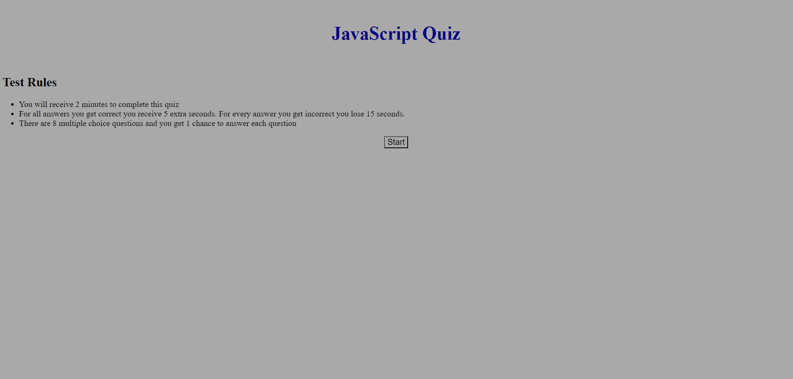
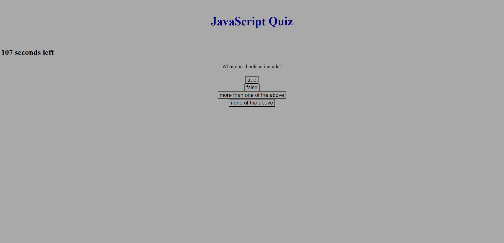

# Timed Quiz on JavaScript

# Description
    -This project involved developing a quiz on the topic of JavaScript.
    -The quiz includes 8 questions and allows for 120 seconds.
    -If the user gets a question wrong, 15 seconds are removed from the timer and if the user gets the question correct, 5 seconds are added to the timer.
    -There is a high scores section where the user is able to determine how they did compared to others.
    
    
# Installation

    Follow the following URL to the website: https://caf62219.github.io/javascript-timed-quiz/
    
# Usage

    
    - When the user clicks on the start button the quiz begins.

    
    - When the user clicks the answer it brings the user to the next page.

# Credits
    Donnie Rawlings: https://github.com/drawlin22/
    Received assistance from Tutor: Neil Dhand.
    

# License
    N/A
